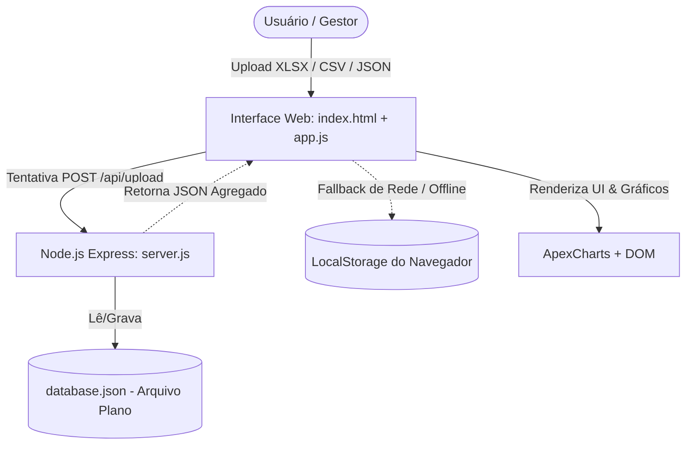

# Diagnóstico do Estado Atual (CURRENT_STATE)
**Sistema de Fechamento de Compras Indiretas · Plurix Holding**
*Data da Auditoria: Agosto/2026 | Versão Auditada: 2.0.0*

---

## 1. Inventário Detalhado dos Arquivos do Projeto

| Arquivo / Recurso | Tipo | Tamanho | Linhas | Responsabilidade Real Auditada |
| :--- | :--- | :--- | :--- | :--- |
| [`index.html`](file:///c:/Users/DaviBigottoLourenço/OneDrive%20-%20PLX%20-%20Plurix/Área%20de%20Trabalho/DASHFECHAMENTO/index.html) | HTML5 | 13.0 KB | 289 | Estrutura visual da aplicação (topbar, segmented controls, 8 abas temáticas, modal de upload, hero dropzone e scripts vinculados). |
| [`styles.css`](file:///c:/Users/DaviBigottoLourenço/OneDrive%20-%20PLX%20-%20Plurix/Área%20de%20Trabalho/DASHFECHAMENTO/styles.css) | CSS3 | 20.7 KB | 925 | Design system corporativo executivo dark (paleta Plurix Navy/Cyan, cards, tags, callouts, tabelas, animações, estados responsivos). |
| [`data.js`](file:///c:/Users/DaviBigottoLourenço/OneDrive%20-%20PLX%20-%20Plurix/Área%20de%20Trabalho/DASHFECHAMENTO/data.js) | JS (ES6/CJS) | 24.3 KB | 332 | Estrutura de dados inicial (`emptyPlurixData`), base demonstrativa histórica consolidada Jan-Jul (`demoPlurixData`) e gerenciador de estado reativo `PlurixDataManager` via `localStorage`. |
| [`charts.js`](file:///c:/Users/DaviBigottoLourenço/OneDrive%20-%20PLX%20-%20Plurix/Área%20de%20Trabalho/DASHFECHAMENTO/charts.js) | JS (ApexCharts) | 7.0 KB | 233 | Motor de renderização gráfica: Evolução Mensal (Área/Linha), Composição CAPEX/OPEX (Donut), Ranking Investidas (Barras Horizontais) e Aging de Estoque (Barras Empilhadas). |
| [`importer.js`](file:///c:/Users/DaviBigottoLourenço/OneDrive%20-%20PLX%20-%20Plurix/Área%20de%20Trabalho/DASHFECHAMENTO/importer.js) | JS | 10.6 KB | 274 | Ingestão e upload de planilhas. Tenta rota `/api/upload` no backend e possui fallback local para leitura de `.xlsx`, `.csv` e `.json` via SheetJS. |
| [`app.js`](file:///c:/Users/DaviBigottoLourenço/OneDrive%20-%20PLX%20-%20Plurix/Área%20de%20Trabalho/DASHFECHAMENTO/app.js) | JS | 40.4 KB | 932 | Controlador central da interface: alternância de abas, modo YTD vs Mês, formatação monetária (BRL/MM), filtros dinâmicos de negociações, renderização de tabelas e KPIs. |
| [`server.js`](file:///c:/Users/DaviBigottoLourenço/OneDrive%20-%20PLX%20-%20Plurix/Área%20de%20Trabalho/DASHFECHAMENTO/server.js) | Node.js/Express | 12.2 KB | 322 | Servidor HTTP local inicial (porta 3333) com rotas para `/api/data`, `/api/reset`, `/api/demo` e upload de planilhas de estocáveis e relatório geral. |
| [`database.json`](file:///c:/Users/DaviBigottoLourenço/OneDrive%20-%20PLX%20-%20Plurix/Área%20de%20Trabalho/DASHFECHAMENTO/database.json) | JSON | 5.3 KB | 291 | Armazenamento de arquivo plano utilizado como banco de dados embrionário pelo `server.js`. |
| [`package.json`](file:///c:/Users/DaviBigottoLourenço/OneDrive%20-%20PLX%20-%20Plurix/Área%20de%20Trabalho/DASHFECHAMENTO/package.json) | JSON | 382 B | 17 | Configuração de dependências Node.js (`express`, `cors`, `multer`, `xlsx`). |
| [`RelatorioGeralCompras...csv`](file:///c:/Users/DaviBigottoLourenço/OneDrive%20-%20PLX%20-%20Plurix/Área%20de%20Trabalho/DASHFECHAMENTO/RelatorioGeralCompras_2026_08_18_10_35_27(Worksheet).csv) | CSV | 2.84 MB | 29.959 lin (4.853 reg) | **Fonte 2 (Validação / Paridade / Contingência)**: Exportação analítica histórica de ordens de compra/requisições do Organizer. |
| `Fechamento Mensal - Procurement_2026.xlsx` | XLSX | 314.5 KB | 972 lin (218 neg) | **Fonte 3 (Gerencial / Complementar)**: Planilha gerencial de Procurement contendo negociações estratégicas, baselines, orçamento, saving reconhecido e dados contratuais. |
| `retornoapi.json` / API Organizer | JSON | 662.7 KB | 1.000 reg (amostra pág 1/16) | **Fonte 1 (Oficial / Primária Operacional)**: Resposta real da API do Organizer contendo 15.272 registros totais paginados em lotes de 1.000. |
| [`DATA_SOURCES_TRUTH.md`](file:///c:/Users/DaviBigottoLourenço/OneDrive%20-%20PLX%20-%20Plurix/Área%20de%20Trabalho/DASHFECHAMENTO/DATA_SOURCES_TRUTH.md) | MD | - | - | **Documento Canônico de Verdade das Fontes de Dados**: Diretrizes de arquitetura, separação conceitual e conciliação. |

---

## 2. Arquitetura Atual e Fluxo de Dados

### Diagnóstico do Fluxo Atual:
1. **Frontend Desacoplado mas Instável**: O frontend tenta comunicar-se com `localhost:3333`. Caso o servidor Node.js esteja offline, ele recorre ao `localStorage`.
2. **Armazenamento em Arquivo Plano Único**: O `database.json` guarda apenas um estado estático do dashboard. Ele não suporta relacionamentos relacionais, histórico de versões, nem bloqueio por concorrência.
3. **Ausência de Conexão com API Externa**: A API do Organizer não é consumida nem pelo backend nem pelo frontend; a carga depende de arquivos manuais.

---

## 3. Análise de Dados Demonstrativos e Hardcoded

A auditoria identificou dependência de dados mockados e hardcoded no estado atual:

1. **Aba "SLA por Área" (`app.js`, linhas 812-835)**:
   - Valores fixos injetados diretamente em HTML: Amigão (40 dias), Avenida (18 dias), Boa Supermercados (29 dias). Não são recalculados a partir da planilha ou da base de requisições.
2. **Aba "Emergenciais" (`app.js`, linhas 840-874)**:
   - KPIs fixos: Valor Total (R$ 8,83 MM), 4.542 requisições, Ticket Médio (R$ 1.944), Tempo Médio (50 dias), Concentração Amigão (88,4%).
3. **Aba "Estoque Indireto" (`app.js`, linhas 880-905)**:
   - Amigão (R$ 4,7 MM), Boa (R$ 3,5 MM), Avenida (R$ 2,1 MM), Paraná (R$ 782 mil).
4. **Metas Orçamentárias (`data.js`)**:
   - Meta Anual (R$ 28.815.322,48) e metas mensais por investida estão fixadas na constante `emptyPlurixData` e `demoPlurixData`.

---

## 4. Tratamento Atual de Planilhas e Parsing

1. **`server.js` e `importer.js`**:
   - **Estocáveis**: Identifica colunas procurando strings como `'ESTOCÁVEIS'`, `'TEMPO DE COBERTURA'` e faixas de dias (`0-30`, `31-60`, etc.).
   - **Relatório Geral**: Faz scan de headers procurando `'ORDEM DE COMPRA'`, `'SLA REQUISIÇÃO'`, `'TIPO DE COMPRA'`, etc.
   - **Problema Crítico de Parsing CSV**: Linhas com quebras de linha (`\n`) dentro de campos de texto entre aspas (como `Finalidade`) quebram parsers simples linha-a-linha. Somente parsers compatíveis com RFC 4180 / SheetJS conseguem estruturar as 4.853 requisições reais.
   - **Inexistência de Parser para `Fechamento Mensal - Procurement_2026.xlsx`**: O backend atual não possui rotina para ler as colunas gerenciais da aba `Fechamento mensal Plurix 2026` (linha de cabeçalho 4, colunas 2 a 28).

---

## 5. Riscos de Segurança e Vulnerabilidades do Estado Atual

1. **Exposição de Segredos**: Ausência de camada de backend protegida para armazenar tokens OAuth/Bearer da API do Organizer.
2. **Ausência de Autenticação e Autorização**: Qualquer pessoa com acesso à URL pode visualizar, limpar (`/api/reset`) ou sobrescrever a base.
3. **Integridade de Dados e Concorrência**: Como o `database.json` é sobrescrito integralmente a cada requisição, múltiplos usuários simultâneos causarão perda de dados (*race conditions*).
4. **Armazenamento Não Auditável**: Operações no `localStorage` e no `database.json` não gravam identificador de usuário, IP, timestamp de auditoria ou valor anterior.

---

## 6. Gaps Funcionais Identificados

1. **Sem conciliação entre fontes**: O sistema não cruza o que foi registrado no Organizer com o que foi lançado na planilha de fechamento.
2. **Sem congelamento de períodos aprovados**: Qualquer mês passado pode ser alterado acidentalmente por nova importação.
3. **Sem segregação de tipos de resultado financeiro**: O dashboard atual soma indiscriminadamente linhas sem diferenciar saving de baseline vs saving de orçamento vs custo evitado vs impacto.
4. **Sem fluxo de governança**: Não há telas ou rotas para submissão, aprovação formal, devolução com justificativa e reabertura auditada.
