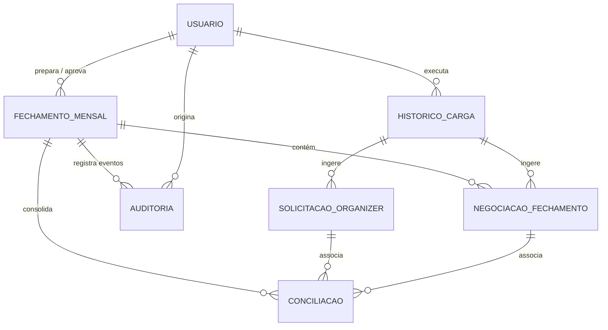

# Modelo de Banco de Dados Relacional (DATABASE_MODEL)
**Especificação Técnica de Entidades e Relacionamentos · Plurix Procurement**

---

## 1. Diagrama Entidade-Relacionamento (ER)



---

## 2. Dicionário de Tabelas e Esquema SQL (DDL)

### 2.1 Tabela `fechamento_mensal` (Controle de Ciclo e Congelamento)
Armazena o estado oficial de cada competência mensal.

```sql
CREATE TABLE fechamento_mensal (
    id INTEGER PRIMARY KEY AUTOINCREMENT,
    ano INTEGER NOT NULL,
    mes INTEGER NOT NULL, -- 1 a 12
    status VARCHAR(30) NOT NULL DEFAULT 'RASCUNHO', 
    -- 'RASCUNHO', 'SINCRONIZANDO', 'AGUARDANDO_PLANILHA', 'EM_REVISAO', 
    -- 'PRONTO_APROVACAO', 'DEVOLVIDO', 'APROVADO', 'CONGELADO', 'REABERTO'
    versao INTEGER NOT NULL DEFAULT 1,
    data_criacao DATETIME NOT NULL DEFAULT CURRENT_TIMESTAMP,
    data_preparacao DATETIME,
    data_aprovacao DATETIME,
    data_congelamento DATETIME,
    preparado_por VARCHAR(100),
    aprovado_por VARCHAR(100),
    justificativa_reabertura TEXT,
    
    -- Totais Consolidados Congelados
    total_negociacoes INTEGER DEFAULT 0,
    total_saving_opex DECIMAL(15,2) DEFAULT 0.00,
    total_saving_capex DECIMAL(15,2) DEFAULT 0.00,
    total_custo_evitado DECIMAL(15,2) DEFAULT 0.00,
    total_impacto DECIMAL(15,2) DEFAULT 0.00,
    total_requisicoes_api INTEGER DEFAULT 0,
    sla_medio_dias DECIMAL(5,2) DEFAULT 0.00,
    inconsistencias_pendentes INTEGER DEFAULT 0,
    
    UNIQUE(ano, mes, versao)
);
```

---

### 2.2 Tabela `solicitacao_organizer` (Dados Operacionais da API)
Armazena as solicitações, cotações e pedidos transacionais vindos da API do Organizer.

```sql
CREATE TABLE solicitacao_organizer (
    id INTEGER PRIMARY KEY AUTOINCREMENT,
    carga_id INTEGER NOT NULL REFERENCES historico_carga(id),
    numero_solicitacao VARCHAR(50), -- Código do chamado / OC
    organizer_id_interno INTEGER,
    data_criacao DATETIME,
    data_aprovacao DATETIME,
    data_finalizacao DATETIME,
    status_nome VARCHAR(80),
    investida_id INTEGER,
    investida_nome VARCHAR(100) NOT NULL,
    unidade_nome VARCHAR(150),
    departamento VARCHAR(100),
    comprador VARCHAR(120),
    categoria VARCHAR(100),
    tipo_compra VARCHAR(50), -- 'SPOT', 'EMERGENCIAL', 'ESTRATEGICA'
    dentro_sla INTEGER, -- 1 ou 0
    dias_atendimento_sla DECIMAL(6,2),
    valor_menor_cotado DECIMAL(15,2),
    valor_final_negociado DECIMAL(15,2),
    saving_operacional DECIMAL(15,2),
    saving_percentual DECIMAL(6,2),
    fornecedor_vencedor VARCHAR(200),
    raw_payload TEXT, -- Payload JSON original preservado para auditoria
    data_sincronizacao DATETIME NOT NULL DEFAULT CURRENT_TIMESTAMP
);
CREATE INDEX idx_solic_num ON solicitacao_organizer(numero_solicitacao);
CREATE INDEX idx_solic_data ON solicitacao_organizer(data_criacao);
CREATE INDEX idx_solic_investida ON solicitacao_organizer(investida_nome);
```

---

### 2.3 Tabela `negociacao_fechamento` (Dados Gerenciais da Planilha)
Armazena as negociações lançadas pelo time de Procurement na planilha oficial.

```sql
CREATE TABLE negociacao_fechamento (
    id INTEGER PRIMARY KEY AUTOINCREMENT,
    fechamento_id INTEGER NOT NULL REFERENCES fechamento_mensal(id),
    carga_id INTEGER NOT NULL REFERENCES historico_carga(id),
    linha_planilha INTEGER NOT NULL,
    codigo_projeto VARCHAR(50),
    codigo_organizer VARCHAR(100), -- Chave informada na planilha
    nome_projeto VARCHAR(250) NOT NULL,
    categoria VARCHAR(100),
    subcategoria VARCHAR(100),
    recorrencia VARCHAR(50), -- 'MENSAL', 'SPOT', 'CONTRATO'
    responsavel_compras VARCHAR(120) NOT NULL,
    investida VARCHAR(100) NOT NULL,
    solicitante VARCHAR(150),
    fornecedor VARCHAR(200),
    modalidade VARCHAR(10) NOT NULL, -- 'CAPEX' ou 'OPEX'
    bc_legal VARCHAR(50),
    mes_conclusao_texto VARCHAR(30),
    mes_conclusao_data DATE,
    tipo_resultado VARCHAR(30) NOT NULL, -- 'SAVING', 'CUSTO EVITADO', 'IMPACTO'
    
    -- Valores Financeiros
    orcamento_2026 DECIMAL(15,2) DEFAULT 0.00,
    baseline_realizado DECIMAL(15,2) DEFAULT 0.00,
    baseline_ajustado DECIMAL(15,2) DEFAULT 0.00,
    valor_fechado_total DECIMAL(15,2) DEFAULT 0.00,
    saving_baseline DECIMAL(15,2) DEFAULT 0.00,
    saving_pct_baseline DECIMAL(6,2) DEFAULT 0.00,
    custo_evitado DECIMAL(15,2) DEFAULT 0.00,
    custo_evitado_pct DECIMAL(6,2) DEFAULT 0.00,
    saving_reconhecido_ano DECIMAL(15,2) DEFAULT 0.00,
    
    esta_no_cronograma VARCHAR(10),
    status_contrato VARCHAR(80),
    prazo_pagamento VARCHAR(80),
    observacoes TEXT,
    data_importacao DATETIME NOT NULL DEFAULT CURRENT_TIMESTAMP
);
CREATE INDEX idx_neg_fechamento ON negociacao_fechamento(fechamento_id);
CREATE INDEX idx_neg_cod_org ON negociacao_fechamento(codigo_organizer);
```

---

### 2.4 Tabela `conciliacao` (Relacionamentos e Divergências)
Armazena a amarração entre solicitações operacionais e negociações gerenciais.

```sql
CREATE TABLE conciliacao (
    id INTEGER PRIMARY KEY AUTOINCREMENT,
    fechamento_id INTEGER NOT NULL REFERENCES fechamento_mensal(id),
    negociacao_id INTEGER REFERENCES negociacao_fechamento(id),
    solicitacao_id INTEGER REFERENCES solicitacao_organizer(id),
    tipo_conciliacao VARCHAR(40) NOT NULL,
    -- 'CONCILIADO_AUTOMATICO', 'CONCILIADO_MANUAL', 'SOMENTE_ORGANIZER', 
    -- 'SOMENTE_FECHAMENTO', 'CONFLITO_VALOR', 'CONFLITO_INVESTIDA', 'CODIGO_AUSENTE'
    divergencia_detectada TEXT,
    justificativa_analista TEXT,
    revisado_por VARCHAR(100),
    data_revisao DATETIME,
    status_aprovacao VARCHAR(30) DEFAULT 'PENDENTE' -- 'PENDENTE', 'RESOLVIDO', 'ACEITO'
);
```

---

### 2.5 Tabela `historico_carga` (Rastreabilidade de Ingestão)

```sql
CREATE TABLE historico_carga (
    id INTEGER PRIMARY KEY AUTOINCREMENT,
    tipo_carga VARCHAR(30) NOT NULL, -- 'API_ORGANIZER', 'PLANILHA_FECHAMENTO', 'ESTOCAVEIS'
    origem_arquivo VARCHAR(255),
    hash_arquivo VARCHAR(64),
    data_inicio DATETIME NOT NULL DEFAULT CURRENT_TIMESTAMP,
    data_fim DATETIME,
    executado_por VARCHAR(100) NOT NULL,
    total_registros_recebidos INTEGER DEFAULT 0,
    total_registros_validos INTEGER DEFAULT 0,
    total_registros_rejeitados INTEGER DEFAULT 0,
    status_carga VARCHAR(20) NOT NULL, -- 'SUCESSO', 'ERRO_PARCIAL', 'FALHA'
    log_erros TEXT
);
```

---

### 2.6 Tabela `auditoria_alteracoes` (Log Imutável)

```sql
CREATE TABLE auditoria_alteracoes (
    id INTEGER PRIMARY KEY AUTOINCREMENT,
    entidade VARCHAR(50) NOT NULL, -- 'fechamento_mensal', 'negociacao_fechamento', 'metas'
    registro_id INTEGER NOT NULL,
    campo_alterado VARCHAR(80) NOT NULL,
    valor_anterior TEXT,
    valor_novo TEXT,
    motivo_alteracao TEXT,
    usuario VARCHAR(100) NOT NULL,
    ip_origem VARCHAR(45),
    data_evento DATETIME NOT NULL DEFAULT CURRENT_TIMESTAMP,
    fechamento_id INTEGER REFERENCES fechamento_mensal(id)
);
```
