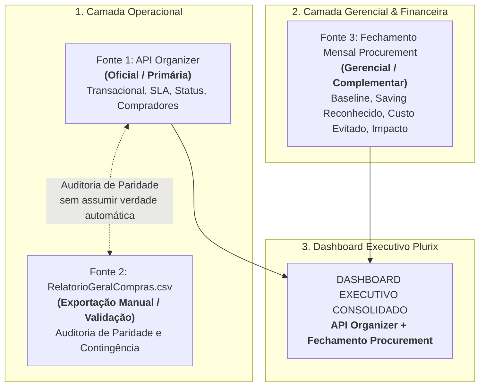

# Verdade das Fontes de Dados · Plurix Procurement

Este documento estabelece as **diretrizes canônicas e imutáveis** de arquitetura de dados e regras de negócio para o Dashboard Executivo de Compras Indiretas da Plurix.

---

## 1. As Três Fontes de Dados

Existem **3 fontes distintas de dados** no ecossistema. Elas **NÃO** são equivalentes e **NÃO** devem ser tratadas da mesma forma:

---

## 2. Detalhamento por Fonte

### Fonte 1 — API Organizer
- **Tipo:** Operacional (Transacional de Compras).
- **Objetivo:** Representar o processo real de compras dentro do sistema Organizer.
- **Papel:** É a **referência oficial operacional**. Sempre que houver divergência operacional, a API do Organizer é a referência principal.
- **Campos Principais:**
  - `numero_solicitacao` / `id`
  - `status_nome`
  - `data_criacao`, `data_aprovacao`, `data_finalizacao`
  - `investida_nome` / `investida_id`
  - `comprador` / `analista`
  - `categoria`
  - `tipo_compra` (`SPOT`, `EMERGENCIAL`, `ESTRATEGICA`)
  - `dentro_sla`, `dias_atendimento_sla`
  - `valor_menor_cotado`
  - `valor_final_negociado`
  - `saving_operacional` (desconto na cotação)
  - `saving_percentual`

---

### Fonte 2 — RelatorioGeralCompras.csv
- **Tipo:** Exportação manual pontual do Organizer.
- **Objetivo:** Representar os mesmos dados operacionais da API (`API Organizer ≈ RelatorioGeralCompras.csv`).
- **Papel:** **Validação de paridade, comparação e contingência**.
- **Regra de Tratamento:**
  - A API substitui a planilha `RelatorioGeralCompras.csv` no fluxo principal de produção.
  - O CSV existe para validar se os dados retornados pela API batem com a extração da TI.
  - Caso haja diferença entre API e CSV:
    1. Registrar a divergência no log de auditoria de paridade;
    2. Permitir investigação pelo time técnico/negócios;
    3. **NÃO assumir automaticamente qual está correta.**
    4. Gerar relatórios de comparação detalhados (Parity Audit Reports).

---

### Fonte 3 — Fechamento Mensal Procurement
- **Tipo:** Gerencial e Financeira.
- **Objetivo:** Complementar os dados operacionais com informações estratégicas da área de Procurement para fechamento contábil e apresentação executiva.
- **Papel:** **Complementa a API (NÃO substitui a API)**.
- **Campos Estratégicos Exclusivos:**
  - `Baseline (12 meses) Realizado`
  - `Baseline Ajustado` (inflação / cotações concorrentes)
  - `Saving Reconhecido` (Saving de Baseline)
  - `Custo Evitado` (*Cost Avoidance*)
  - `Impacto` (Receitas/Desmobilizações extraordinárias)
  - `Orçamento 2026`
  - `Cronograma`
  - `BC Legal`
  - `Status Contrato`
  - `Observações e Classificações Gerenciais`

---

## 3. Regras Críticas de Separação Conceitual

> [!IMPORTANT]
> É terminantemente proibido mesclar ou assumir igualdade entre conceitos operacionais da cotação e conceitos gerenciais de Procurement.

| Conceito Operacional (API Organizer) | $\neq$ | Conceito Gerencial (Fechamento Procurement) | Racional |
| :--- | :---: | :--- | :--- |
| **`saving_operacional`** (ou `saving_valor` da API) | $\neq$ | **`saving_baseline` / `saving_reconhecido`** | O saving da API mede o desconto obtido na rodada de cotação contra a primeira proposta. O saving de Procurement mede o ganho real contratado contra o baseline histórico de 12 meses. |
| **`valor_final_negociado`** | $\neq$ | **`impacto`** | O valor negociado é o gasto contratado. Impacto representa receitas ou desmobilizações extraordinárias (venda de ativos/sucatas, indenizações). |
| **`saving operacional`** | $\neq$ | **`custo evitado`** | Custo evitado é a mitigação comprovada de reajuste contratual sem redução contábil líquida. |

---

## 4. Chaves de Ligação e Classificação de Conciliação

### Chave Primária Candidata:
- **`Código Organizer`** (presente na Planilha de Fechamento) $\leftrightarrow$ **`numero_solicitacao` / `ID`** (presente na API Organizer).

### Matriz Determinística de Classificação:
Quando a rotina de conciliação cruza as duas camadas, cada registro recebe exatamente um dos status:

1. **`CONCILIADO`**:
   - Houve match unívoco entre `Código Organizer` e a API, com compatibilidade de investida e valor.
2. **`SOMENTE_API`**:
   - Chamado operacional presente no Organizer, mas não associado a uma negociação gerencial de fechamento (típico de compras pontuais SPOT de rotina).
3. **`SOMENTE_PROCUREMENT`**:
   - Negociação lançada na planilha de fechamento sem registro correspondente no Organizer (típico de negociações corporativas globais de holding sem requisição unitária aberta no portal).
4. **`CONFLITO`**:
   - Chave encontrada em ambas as fontes, mas com divergência material de valores (> 2%) ou divergência de investida.
5. **`REQUER_REVISAO`**:
   - Linhas sem Código Organizer preenchido ou relacionamentos ambíguos (N:1, 1:N) que necessitam de parecer explícito do analista.

> [!CAUTION]
> **Proibição:** Nunca criar relacionamentos artificiais ou heurísticas forçadas sem evidência direta na chave.
