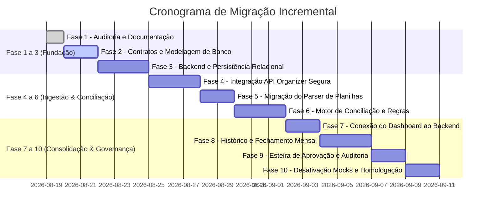

# Plano de Migração Incremental (MIGRATION_PLAN)
**Roteiro de Evolução Arquitetural por Fases · Plurix Procurement**

---

## 1. Princípios da Migração

1. **Zero Downtime e Continuidade Operacional**: A versão visual funcional atual deve continuar operacional para visualização executiva durante todo o processo.
2. **Evolução Não-Destrutiva**: Nenhuma linha de código ou componente existente será descartado sem substituição equivalente validada.
3. **Validação Passo a Passo**: Cada fase possui critérios de aceite objetivos antes de avançar para a seguinte.

---

## 2. Cronograma e Fases de Execução

---

## 3. Detalhamento das Fases e Critérios de Aceite

### Fase 1: Auditoria Integral e Arquitetura *(Concluída nesta entrega)*
- Inventário de arquivos, mapeamento de fontes e identificação de dados hardcoded.
- Criação dos documentos de especificação (`CURRENT_STATE.md`, `TARGET_ARCHITECTURE.md`, `KPI_CATALOG.md`, etc.).

### Fase 2: Contratos de Dados e Modelo de Banco
- Criação dos esquemas SQL e migrações do banco relacional (SQLite/PostgreSQL).
- Seed inicial com a base de metas orçamentárias corporativas 2026.

### Fase 3: Backend e Persistência Relacional
- Estruturação dos módulos do servidor Node.js/Express com arquitetura em camadas (`routes/`, `controllers/`, `services/`, `repositories/`).
- Implementação de pool de conexões e transações ACID.

### Fase 4: Integração com a API do Organizer em Ambiente Seguro
- Módulo de sincronização com consumo paginado das 16 páginas (15.272 registros).
- Armazenamento do Bearer Token exclusivo em `.env`.
- Tratamento de retries com *exponential backoff* e rate limiting.

### Fase 5: Migração da Importação da Planilha para o Backend
- Parser robusto de `.xlsx` no backend para a aba `Fechamento mensal Plurix 2026`.
- Validação tipada de valores, datas, baselines e modalidades contábeis.
- Geração de relatório de inconsistências antes de gravar no banco.

### Fase 6: Motor de Conciliação de Dados
- Algoritmo de cruzamento entre Solicitações da API e Negociações da Planilha.
- Classificação automática dos registros em: Conciliado, Requer Revisão, Código Ausente, Conflito de Valores, etc.
- Interface web administrativa para resolução humana de pendências.

### Fase 7: Conexão do Dashboard Executivo ao Backend
- Substituição das chamadas de `localStorage` do frontend por endpoints REST (`/api/v1/dashboard/*`).
- Preservação da estética visual dark, dos gráficos ApexCharts e dos seletores de período.

### Fase 8: Histórico e Gestão de Fechamento Mensal
- Implementação da máquina de estados do fechamento mensal.
- Congelamento oficial de meses fechados (imutabilidade de dados históricos).
- Suporte a versionamento de fechamento.

### Fase 9: Esteira de Aprovação e Auditoria Central
- Telas de submissão pelo Gestor e aprovação pela Diretoria.
- Registro completo de trilha de auditoria para todas as alterações.

### Fase 10: Desativação de Mocks e Go-Live
- Remoção definitiva de fallbacks locais de demonstração em ambiente de produção.
- Testes ponta-a-ponta com dados reais consolidados de Janeiro a Agosto/2026.
