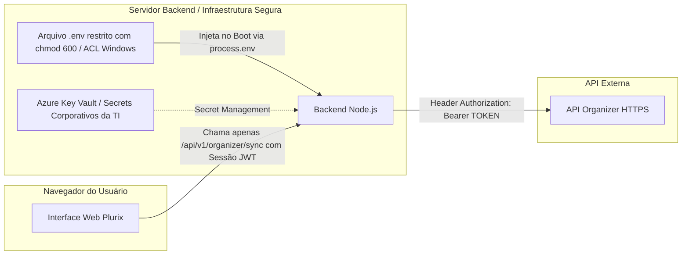

# Diretrizes de Segurança e Gestão de Segredos (SECURITY)
**Políticas de Proteção de Dados e Governança · Plurix Procurement**

---

## 1. Regra Inegociável de Proteção de Segredos

> [!CAUTION]
> **Proibição Absoluta de Credenciais no Frontend:**
> O Bearer Token da API do Organizer, senhas de banco ou chaves de criptografia **NUNCA** devem ser inseridos em:
> - Arquivos HTML, JS clientes (`index.html`, `app.js`, `data.js`, `importer.js`, `charts.js`);
> - `localStorage`, `sessionStorage` ou Cookies acessíveis por JavaScript;
> - Repositórios Git ou arquivos versionados;
> - Parâmetros de URL (`query strings`) ou mensagens de erro enviadas ao cliente;
> - Logs públicos ou console do navegador.

---

## 2. Estratégia de Armazenamento Seguro de Credenciais

---

## 3. Matriz de Controle de Acesso Baseado em Perfis (RBAC)

| Perfil | Descrição | Permissões no Sistema |
| :--- | :--- | :--- |
| **Leitor** | Diretores, Gerentes Regionais e Visualizadores | Consulta dashboards e relatórios consolidados de períodos **congelados/aprovados**. |
| **Analista** | Compradores e Analistas de Procurement | Dispara sincronização com Organizer, faz upload da planilha, edita justificativas e resolve conciliações. |
| **Gestor** | Coordenadores e Gerentes de Procurement | Revisa o fechamento mensal consolidado, valida pendências e submete para aprovação. |
| **Aprovador** | Diretor de Procurement / Controladoria Holding | Aprova ou devolve o fechamento mensal, autoriza congelamento oficial do mês. |
| **Administrador** | Equipe de TI / Sustentação | Configura parâmetros do sistema, tabela de metas orçamentárias, conexões e permissões de usuários. |

---

## 4. Estratégia de Autenticação Corporativa (Entra ID)

1. **Fase Atual (Transição Controlada)**:
   - Autenticação via tokens JWT emitidos pelo backend com expiração curta (8 horas) e rotação de segredo.
2. **Fase Corporativa (Integração TI Plurix)**:
   - Autenticação federada via **Microsoft Entra ID (OpenID Connect / OAuth2)**.
   - O usuário faz login com sua conta `@plurix.com.br` com suporte nativo a Multi-Factor Authentication (MFA).
   - O backend valida o token de acesso emitido pelo Azure AD e extrai as *claims* de grupos (`Security Groups`) para atribuir automaticamente os papéis RBAC.

---

## 5. Medidas de Blindagem Técnica

1. **Sanitização de Uploads**:
   - Validação de formato de arquivo no backend via verificação de *magic numbers* (evitando arquivos maliciosos renomeados para `.xlsx`).
   - Limite estrito de tamanho de upload (ex: 25 MB).
2. **Proteção de Banco de Dados**:
   - Utilização obrigatória de *Prepared Statements* / ORM para imunidade total a SQL Injection.
3. **CORS e Rate Limiting**:
   - CORS restrito ao domínio corporativo da aplicação.
   - Rate limiting no backend (máximo de 100 requisições/min por IP) para proteção contra abusos.
