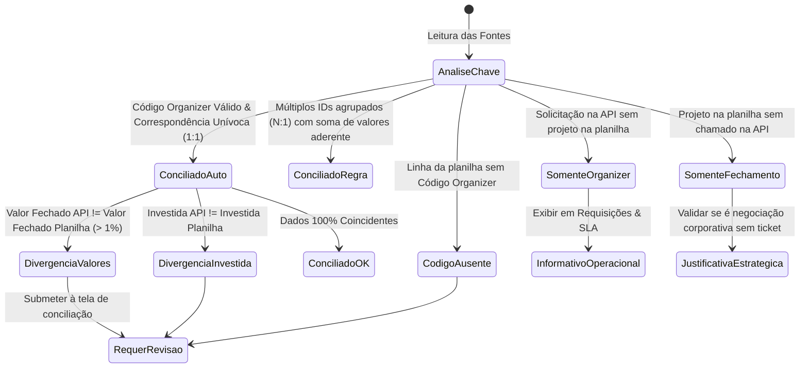

# Mapeamento de Fontes de Dados (SOURCE_MAPPING)
**Cruzamento Operacional e Gerencial · Plurix Holding**

---

## 1. Visão Geral das Fontes

| Dimensão | Fonte 1: API Organizer | Fonte 2: Planilha Fechamento Procurement | Fonte 3 (Legado): CSV Relatório Geral |
| :--- | :--- | :--- | :--- |
| **Natureza** | Operacional de Compras (Transacional) | Gerencial / Financeira / Estratégica | Histórico Operacional Exportado |
| **Formato** | JSON REST Paginado (16 págs, ~15.272 reg) | Pasta de Trabalho XLSX (Aba Fechamento 2026) | CSV delimitado por ponto-e-vírgula (4.853 reg) |
| **Origem** | Sistema Organizer (Portal de Requisições) | Time de Procurement / Controladoria | Exportação manual pontual do Organizer |
| **Granularidade** | Linha por Solicitação / Cotação / Pedido | Linha por Projeto / Negociação Formalizada | Linha por Solicitação / Ordem de Compra |
| **Papel no Sistema** | Fonte da verdade para SLA, Prazos e Cotações | Fonte da verdade para Saving, Baseline e Metas | Base de validação histórica retroativa |

---

## 2. Mapa Comparativo de Campos

| Campo do Modelo Alvo | Fonte API Organizer (`retornoapi.json`) | Planilha Procurement (`Fechamento Mensal`) | CSV Histórico (`RelatorioGeralCompras`) | Regra de Tratamento / Transformação |
| :--- | :--- | :--- | :--- | :--- |
| **`codigo_projeto`** | *N/A* | Col 2 (`CÓDIGO DO PROJETO`) | *N/A* | Identificador sequencial gerencial (ex: 1, 2, 3...). |
| **`codigo_organizer`** | `numero_solicitacao` / `id` | Col 4 (`CÓD ORGANIZER`) | `ID` / `Ordem de Compra` / `Link` | Chave de relacionamento primária entre as fontes. |
| **`descricao_negociacao`** | *N/A* (ou `Finalidade`) | Col 3 (`NOME / DESCRIÇÃO DO PROJETO`) | `Finalidade` | Nome oficial do projeto gerencial. |
| **`categoria`** | `categoria` (ex: "Utilities", "Equipamentos") | Col 5 (`CATEGORIA`) | `Categoria` | Mapeamento padronizado de categorias corporativas. |
| **`subcategoria`** | *N/A* | Col 6 (`SUB-CATEGORIA`) | *N/A* | Subcategoria gerencial cadastrada em Procurement. |
| **`tipo_recorrencia`** | `tipo_compra` (`SPOT`, `ESTRATEGICA`) | Col 7 (`PAGAMENTO MENSAL OU SPOT?`) | `Tipo de Compra` | Normalizar para: `MENSAL`, `SPOT`, `CONTRATO_ANUAL`. |
| **`responsavel_compras`** | `comprador` (Nome completo) | Col 8 (`RESPONSÁVEL COMPRAS`) | `Analista` | Normalizar strings e resolver apelidos/grafias. |
| **`investida`** | `investida_nome` / `investida_id` | Col 9 (`Investida`) | `Investida` | Normalizar para: Amigão, Avenida, Boa, Paraná, Superpão, Holding. |
| **`solicitante`** | *N/A* | Col 10 (`SOLICITANTE`) | *N/A* | Área/Pessoa requisitante formal. |
| **`fornecedor`** | *N/A* (ou texto em `Finalidade`) | Col 11 (`Fornecedor`) | `Fornecedor` | Fornecedor homologado/vencedor. |
| **`modalidade_contabil`**| *N/A* | Col 12 (`CAPEX OU OPEX`) | *N/A* | Classificação contábil estrita (`CAPEX` ou `OPEX`). |
| **`mes_conclusao`** | `data_aprovacao` / `data_finalizacao` | Col 14 (`MÊS DE CONCLUSÃO`) | `Aprovado` / `Gerar/Envio Pedido` | Mapeamento para mês de competência do fechamento. |
| **`tipo_resultado`** | *N/A* | Col 15 (`SAVING OU CUSTO EVITADO?`) | *N/A* | Enum: `SAVING`, `CUSTO EVITADO`, `IMPACTO`. |
| **`orcamento`** | *N/A* | Col 16 (`ORÇAMENTO 2026`) | `Valor de Orçamento` | Orçamento planejado para o pacote. |
| **`baseline`** | *N/A* | Col 17 (`BASELINE (12 meses) REALIZADO`)| `Preço Histórico` | Histórico real de 12 meses anteriores. |
| **`baseline_ajustado`** | *N/A* | Col 18 (`BASELINE AJUSTADO`) | *N/A* | Baseline corrigido por inflação ou cotação de mercado. |
| **`valor_fechado`** | `valor_final_negociado` | Col 19 (`VALOR FECHADO TOTAL`) | `Valor Fechado` / `Valor` | Valor contratado efetivo. |
| **`saving_baseline`** | *N/A* | Col 20 (`SAVING BASELINE`) | *N/A* | `Baseline Ajustado - Valor Fechado`. |
| **`saving_operacional`** | `saving_valor` | *N/A* | *N/A* | `Valor Menor Cotado - Valor Final Negociado`. |
| **`custo_evitado`** | *N/A* | Col 22 (`CUSTO EVITADO`) | *N/A* | Evitamento de reajuste ou redução fora de baseline. |
| **`status_sla`** | `dentro_sla` (1 ou 0) | *N/A* | `SLA Requisição (dias)` | Flag booleana de atendimento ao prazo acordado. |
| **`tempo_sla_dias`** | `dias_atendimento_sla` | *N/A* | `SLA Cotação (dias)` | Quantidade de dias úteis consumidos no processo. |

---

## 3. Análise da Chave `Código Organizer` e Cardinalidade Real

### Diagnóstico de Integridade da Chave:
1. **API Organizer**: O campo `numero_solicitacao` possui formato alfanumérico (ex: `"PC30683083"`, `"PC30600LOJ"`) ou numérico (ex: `"30309"` no CSV).
2. **Planilha de Fechamento**: O campo `CÓD ORGANIZER` na planilha analisada contém lacunas (linhas sem preenchimento ou com múltiplos códigos agrupados).
3. **Cardinalidade Real Encontrada**:
   - **1 para 1**: 1 Solicitação do Organizer $\leftrightarrow$ 1 Negociação de Fechamento.
   - **N para 1**: Várias Solicitações do Organizer (ex: requisições de 10 lojas diferentes para o mesmo contrato corporativo de uniformes) $\leftrightarrow$ 1 Linha de Projeto de Fechamento.
   - **1 para N**: 1 Solicitação mãe que gerou divisões por investida na planilha.
   - **0 para 1**: Negociações corporativas de Holding ou renegociações globais sem emissão de chamado individual no Organizer.
   - **1 para 0**: Chamados operacionais SPOT do dia a dia que não compõem negociações estratégicas de saving de fechamento.

---

## 4. Matriz de Classificação da Conciliação

