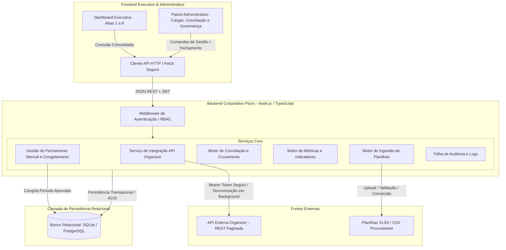

# Arquitetura Alvo do Sistema (TARGET_ARCHITECTURE)
**Sistema Corporativo de Fechamento de Compras Indiretas · Plurix Holding**

---

## 1. Visão Geral da Arquitetura Proposta

A arquitetura foi projetada para preservar integralmente a interface executiva e o design system existentes, transformando a camada de processamento em um backend robusto, seguro, auditável e preparado para o ecossistema corporativo da Plurix.

---

## 2. Componentes Estruturais da Solução

1. **Frontend**:
   - Camada 1: **Dashboard Executivo** (index.html, charts.js, styles.css) consumindo exclusivamente dados consolidados de períodos aprovados.
   - Camada 2: **Área Administrativa** para analistas e gestores operarem o fluxo de sincronização, upload da planilha, conferência de conciliação e aprovação.
2. **Backend**:
   - Node.js (Express / Fastify) desacoplado do cliente, centralizando regras de negócio e validação estrita.
3. **Banco de Dados**:
   - Modelo relacional (tabelas dedicadas para Solicitações API, Negociações Gerenciais, Conciliações, Fechamento Mensal, Histórico de Cargas, Metas e Auditoria).
4. **Serviço de Integração Organizer**:
   - Gerencia autenticação Bearer, paginação completa (páginas 1 a N), controle de *rate limit* (429), retries com *backoff*, timeouts e sincronização incremental.
5. **Importador de Planilhas**:
   - Validação de cabeçalho tolerante a acentos/espaços, conversão tipada de datas/moedas, detecção de fórmulas inválidas e emissão de relatório de consistência pré-persistência.
6. **Motor de Conciliação**:
   - Relaciona registros via Código Organizer ou chaves secundárias, identificando divergências de valor, investida e comprador, categorizando pendências para revisão humana.
7. **Motor de Indicadores (KPI Engine)**:
   - Aplicação determinística das fórmulas contábeis documentadas no `KPI_CATALOG.md`.
8. **Gestão de Fechamento & Governança**:
   - Máquina de estados para fechamentos mensais: `RASCUNHO` $\rightarrow$ `SINCRONIZANDO` $\rightarrow$ `AGUARDANDO_PLANILHA` $\rightarrow$ `EM_REVISAO` $\rightarrow$ `PRONTO_APROVACAO` $\rightarrow$ `APROVADO` $\rightarrow$ `CONGELADO`.
9. **Auditoria & Logs**:
   - Registro imutável de todas as ações (`quem`, `quando`, `entidade`, `valor_anterior`, `novo_valor`, `motivo`).
10. **Segurança & Variáveis de Ambiente**:
    - Proteção estrita de credenciais em `.env` / Azure Key Vault; proibição de tokens no código cliente.

---

## 3. Comparativo de Arquiteturas para Decisão

| Critério | Opção 1: Recomendada (Node.js + SQLite/PostgreSQL) | Opção 2: Simplificada (Node.js + SQLite Local) | Opção 3: Corporativa Completa (Azure App Service + Azure SQL + Entra ID) |
| :--- | :--- | :--- | :--- |
| **Complexidade de Implantação** | Baixa a Média (Executa no ambiente atual ou container) | Mínima (Standalone com arquivo SQLite único) | Média/Alta (Requer infraestrutura em nuvem e apoio da TI) |
| **Banco de Dados** | SQLite (dev/on-prem) ou PostgreSQL | SQLite local embedded | Azure SQL Database (PaaS) |
| **Autenticação** | JWT / Perfis Locais (preparado para Entra ID) | Perfis de sessão básica | Microsoft Entra ID (SSO corporativo Azure AD) |
| **Concorrência e Escala** | Excelente para o volume de compras Plurix | Adequado para equipe pequena (< 5 usuários simultâneos) | Nível enterprise corporativo com alta disponibilidade |
| **Segurança de Segredos** | Variáveis de ambiente protegidas no servidor | Arquivo `.env` protegido no servidor | Azure Key Vault gerenciado |
| **Dependência Inicial da TI** | Baixa (Pode rodar imediatamente no servidor local) | Nula | Alta (Provisionamento de recursos Azure, tenant e permissões) |
| **Recomendação** | **RECOMENDADA PARA ETAPA ATUAL** | **Opção de transição imediata** | **Alvo final após homologação com a TI** |

---

## 4. Dependências Técnicas e de TI

1. **Acesso à API do Organizer**:
   - Endpoint base oficial da API em produção e homologação.
   - Credencial/Bearer Token corporativo permanente para o serviço backend.
   - Liberação de regras de firewall / proxy corporativo para o IP de saída do servidor backend.
2. **Infraestrutura de Execução**:
   - Servidor Windows Server ou Linux com Node.js LTS (v20+) instalado ou Docker Host.
   - Porta de serviço liberada na rede interna da Plurix (ex: 3333 ou 80/443 via IIS/Nginx).
3. **Identidade Corporativa (Fase Futura)**:
   - Registro do aplicativo (*App Registration*) no Microsoft Entra ID para autenticação Single Sign-On (SSO) com contas corporativas `@plurix.com.br`.
